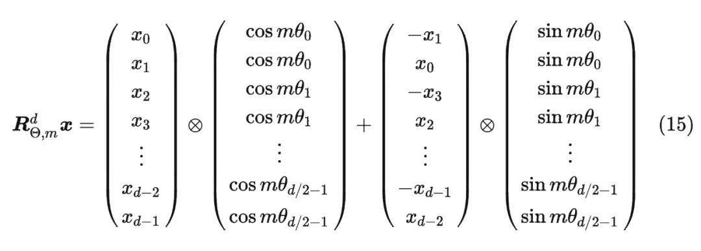

#Code review in LoRA and Llama3.1

In this document, I will use llama-factory to fine-tune Llama3.1 with LoRA (Low-Rank Adaptation) and explain how it works.

Model: `llama3.1-8b`
PyTorch: `2.1.0`
llama-factory: `0.1.0`
CUDA version: `12.4`
cuDNN version: `90100`

## LoRA (Low-Rank Adaptation)
LoRA is a technique used to adapt large language models (LLMs) by introducing low-rank matrices into the model's architecture.

### How it works
1. **Low-Rank Decomposition**: LoRA decomposes the weight matrices of the model into two smaller matrices, which reduces the number of parameters that need to be trained. 
In the code snippet below, `lora_A` and `lora_B` are the low-rank matrices that are introduced into the model. 
**Code: python3.10/dist-packages/peft/tuners/lora/layer.py:700~746**
```python
lora_A = self.lora_A[active_adapter]
lora_B = self.lora_B[active_adapter]
dropout = self.lora_dropout[active_adapter]
scaling = self.scaling[active_adapter]
x = self._cast_input_dtype(x, lora_A.weight.dtype)

if not self.use_dora[active_adapter]:
    result = result + lora_B(lora_A(dropout(x))) * scaling
```

2. **Inference**: During inference, the low-rank matrices are used to compute the output of the model without modifying the original weights. This allows for efficient adaptation of the model to new tasks or domains without retraining the entire model.

### DoRA (Weight-Decomposed Low-Rank Adaptation)
DoRA is an extension of LoRA that uses weight decomposition to further reduce the number of parameters that need to be trained. It is more efficient than LoRA in terms of memory usage and computational cost.

#### Why is lora_A's gradient all 0 but lora_B's gradient is not?
The most common reason for this behavior is the standard initialization scheme for LoRA layers.

- lora_A weights are initialized with a random distribution (like Kaiming uniform).
- lora_B weights are initialized to all zeros.

The purpose of this is to make the LoRA path have zero effect at the beginning of training. The forward pass of a LoRA-adapted layer is effectively output = Wx + B(A(x)), where W is the original frozen weight. If B is a zero matrix, the output is just Wx, meaning the fine-tuning starts from the original pre-trained model's behavior and learns the adaptation BA from there.

**How this affects gradients:**
Let's look at the backpropagation math (simplified):

- The gradient for lora_B's weights is calculated based on the output of lora_A. Since lora_A has random weights, its output is non-zero, and thus lora_B receives non-zero gradients.
- The gradient for lora_A's weights depends on the weights of lora_B. The formula is roughly: grad(A) ≈ W_B^T * grad(output).
If the weights of lora_B (W_B) are all zero, then W_B^T is also a zero matrix. Consequently, grad(A) will be a zero tensor.


## Llama 3.1

### Model Architecture
Llama 3.1 is a large language model that uses a transformer architecture. It consists of multiple layers of self-attention and feed-forward networks. The model is designed to handle a wide

### Attention Layers

The attention layers in Llama 3.1 are responsible for computing the attention scores between different tokens in the input sequence.
**Code: python3.10/dist-packages/transformers/models/llama/modeling_llama.py:301~341**
```python
residual = hidden_states

hidden_states = self.input_layernorm(hidden_states)

# Self Attention Here
hidden_states, self_attn_weights = self.self_attn(
    hidden_states=hidden_states,
    attention_mask=attention_mask,
    position_ids=position_ids,
    past_key_value=past_key_value,
    output_attentions=output_attentions,
    use_cache=use_cache,
    cache_position=cache_position,
    position_embeddings=position_embeddings,
    **kwargs,
)
hidden_states = residual + hidden_states

# Fully Connected
residual = hidden_states
hidden_states = self.post_attention_layernorm(hidden_states)
hidden_states = self.mlp(hidden_states) 
hidden_states = residual + hidden_states

outputs = (hidden_states,)
if output_attentions:
    outputs += (self_attn_weights,)

return outputs
```

#### Self-Attention Mechanism
self attention is computed by this equation:
```math
\text{Attention}(Q, K, V, O) = F_{O}(\text{softmax}\left(\frac{QK^T}{\sqrt{d_k}}\right)V)
```
where \(Q\), \(K\), \(V\), and \(O\) are the query, key, value, and output matrices respectively, and \(d_k\) is the dimension of the key vectors.
**Code: python3.10/dist-packages/transformers/models/llama/modeling_llama.py:188~211**
```python
key_states = repeat_kv(key, module.num_key_value_groups)
value_states = repeat_kv(value, module.num_key_value_groups)

attn_weights = torch.matmul(query, key_states.transpose(2, 3)) * scaling #--> Q@K^T
if attention_mask is not None:
    causal_mask = attention_mask[:, :, :, : key_states.shape[-2]]
    attn_weights = attn_weights + causal_mask

attn_weights = nn.functional.softmax(attn_weights, dim=-1, dtype=torch.float32).to(query.dtype) #--> softmax(Q@K^T)
attn_weights = nn.functional.dropout(attn_weights, p=dropout, training=module.training)
attn_output = torch.matmul(attn_weights, value_states) #--> softmax(Q@K^T)@V
attn_output = attn_output.transpose(1, 2).contiguous()
attn_output = attn_output.reshape(*input_shape, -1).contiguous()
attn_output = self.o_proj(attn_output) #--> F_O(softmax(Q@K^T)@V)
```

#### RoPE
RoPE (Rotary Position Embedding) is a technique used to incorporate positional information into the self-attention mechanism. It allows the model to understand the order of tokens in the input sequence without relying on absolute positional embeddings.
The original equation for RoPE is as follows:

If we implement RoPE for each pair of dimensions, it requires a matrix reshuffle, which can be inefficient. Here is the code that implements original RoPE of second matrix:
```python
# Example of RoPE for each pair of dimensions
def shuffle_x(x):
    x1 = x[..., 0::2]  # Even indices
    x2 = x[..., 1::2]  # Odd indices
    return torch.stack((x1, x2), dim=-1)  # Stack along
```
So it is generalized in the code to this to avoid matrix shuffle:
```math
\begin{pmatrix}
x'_{m, 2i} \\
x'_{m, 2i+1}
\end{pmatrix}
=
\begin{pmatrix}
\cos(m\theta_i) & -\sin(m\theta_i) \\
\sin(m\theta_i) & \cos(m\theta_i)
\end{pmatrix}
\begin{pmatrix}
x_{m, 2i} \\
x_{m, 2i+1}
\end{pmatrix}
```
Here is the optimized implementation of RoPE in the code:
```python
def rotate_half(x):
    """Rotates half the hidden dims of the input."""
    x1 = x[..., : x.shape[-1] // 2]
    x2 = x[..., x.shape[-1] // 2 :]
    return torch.stack((-x2, x1), dim=-1).reshape(x.shape)  #--> inefficient matrix shuffle
```
This is how it works:
where `cos` and `sin` are the cosine and sine values computed from the positional embeddings.
This is how RoPE is implemented in the code:
**code: dist-packages/transformers/models/llama/modeling_llama.py:153~157**
```python
def apply_rotary_pos_emb(q, k, cos, sin, unsqueeze_dim=-2):
    q_embed = (q * cos) + (rotate_half(q) * sin)
    k_embed = (k * cos) + (rotate_half(k) * sin)
    return q_embed, k_embed
cos = cos.unsqueeze(unsqueeze_dim)
sin = sin.unsqueeze(unsqueeze_dim)
query_states, key_states = apply_rotary_pos_emb(query_states, key_states, cos, sin)
```

#### MLP (Multi-Layer Perceptron)
The MLP in Llama 3.1 consists of two linear layers with a GELU activation function in between. It is used to process the output from the self-attention layer and produce the final output of the transformer block.
**Code: python3.10/dist-packages/transformers/models/llama/modeling_llama.py:160~173**
```python
class LlamaMLP(nn.Module):
    def __init__(self, config):
        super().__init__()
        self.config = config
        self.hidden_size = config.hidden_size
        self.intermediate_size = config.intermediate_size
        self.gate_proj = nn.Linear(self.hidden_size, self.intermediate_size, bias=config.mlp_bias)
        self.up_proj = nn.Linear(self.hidden_size, self.intermediate_size, bias=config.mlp_bias)
        self.down_proj = nn.Linear(self.intermediate_size, self.hidden_size, bias=config.mlp_bias)
        self.act_fn = ACT2FN[config.hidden_act]

    def forward(self, x):
        down_proj = self.down_proj(self.act_fn(self.gate_proj(x)) * self.up_proj(x))
        return down_proj
```
The difference between the MLP and original GLU is:
1. Using a SiLU `f(x)=x*sigmoid(x)` activation function instead of a sigmoid function.
2. Adding a down projection layer to reduce the dimensionality of the output.

### LoRA in linear layers
```python
-> Linear(in_features, out_features, bias=False)
lora.Linear(
  (base_layer): Linear(in_features=4096, out_features=14336, bias=False)
  (lora_dropout): ModuleDict(
    (default): Identity()
  )
  (lora_A): ModuleDict(
    (default): Linear(in_features=4096, out_features=6, bias=False)
  ) #warpped low-rank matrix A
  (lora_B): ModuleDict(
    (default): Linear(in_features=6, out_features=14336, bias=False)
  ) #warpped low-rank matrix B
  (lora_embedding_A): ParameterDict()
  (lora_embedding_B): ParameterDict()
  (lora_magnitude_vector): ModuleDict()
)
```

### Llama decode layer
**python3.10/dist-packages/transformers/models/llama/modeling_llama.py:301~341**
```python
residual = hidden_states #input hidden states

# Self Attention
hidden_states, self_attn_weights = self.self_attn(
    hidden_states=hidden_states,
    attention_mask=attention_mask,
    position_ids=position_ids,
    past_key_value=past_key_value,
    output_attentions=output_attentions,
    use_cache=use_cache,
    cache_position=cache_position,
    position_embeddings=position_embeddings,
    **kwargs,
)
hidden_states = residual + hidden_states

# Fully Connected
residual = hidden_states
hidden_states = self.post_attention_layernorm(hidden_states) #RMSNorm here
hidden_states = self.mlp(hidden_states) 
hidden_states = residual + hidden_states

outputs = (hidden_states,)
if output_attentions:
    outputs += (self_attn_weights,)
```

Structure of one decoder layer:
```python
LlamaDecoderLayer(
  (self_attn): LlamaAttention(
    (q_proj): lora.Linear(
      (base_layer): Linear(in_features=4096, out_features=4096, bias=False)
      (lora_dropout): ModuleDict(
        (default): Identity()
      )
      (lora_A): ModuleDict(
        (default): Linear(in_features=4096, out_features=6, bias=False)
      )
      (lora_B): ModuleDict(
        (default): Linear(in_features=6, out_features=4096, bias=False)
      )
      (lora_embedding_A): ParameterDict()
      (lora_embedding_B): ParameterDict()
      (lora_magnitude_vector): ModuleDict()
    )
    (k_proj): lora.Linear(
      (base_layer): Linear(in_features=4096, out_features=1024, bias=False)
      (lora_dropout): ModuleDict(
        (default): Identity()
      )
      (lora_A): ModuleDict(
        (default): Linear(in_features=4096, out_features=6, bias=False)
      )
      (lora_B): ModuleDict(
        (default): Linear(in_features=6, out_features=1024, bias=False)
      )
      (lora_embedding_A): ParameterDict()
      (lora_embedding_B): ParameterDict()
      (lora_magnitude_vector): ModuleDict()
    )
    (v_proj): lora.Linear(
      (base_layer): Linear(in_features=4096, out_features=1024, bias=False)
      (lora_dropout): ModuleDict(
        (default): Identity()
      )
      (lora_A): ModuleDict(
        (default): Linear(in_features=4096, out_features=6, bias=False)
      )
      (lora_B): ModuleDict(
        (default): Linear(in_features=6, out_features=1024, bias=False)
      )
      (lora_embedding_A): ParameterDict()
      (lora_embedding_B): ParameterDict()
      (lora_magnitude_vector): ModuleDict()
    )
    (o_proj): lora.Linear(
      (base_layer): Linear(in_features=4096, out_features=4096, bias=False)
      (lora_dropout): ModuleDict(
        (default): Identity()
      )
      (lora_A): ModuleDict(
        (default): Linear(in_features=4096, out_features=6, bias=False)
      )
      (lora_B): ModuleDict(
        (default): Linear(in_features=6, out_features=4096, bias=False)
      )
      (lora_embedding_A): ParameterDict()
      (lora_embedding_B): ParameterDict()
      (lora_magnitude_vector): ModuleDict()
    )
  )
  (mlp): LlamaMLP(
    (gate_proj): lora.Linear(
      (base_layer): Linear(in_features=4096, out_features=14336, bias=False)
      (lora_dropout): ModuleDict(
        (default): Identity()
      )
      (lora_A): ModuleDict(
        (default): Linear(in_features=4096, out_features=6, bias=False)
      )
      (lora_B): ModuleDict(
        (default): Linear(in_features=6, out_features=14336, bias=False)
      )
      (lora_embedding_A): ParameterDict()
      (lora_embedding_B): ParameterDict()
      (lora_magnitude_vector): ModuleDict()
    )
    (up_proj): lora.Linear(
      (base_layer): Linear(in_features=4096, out_features=14336, bias=False)
      (lora_dropout): ModuleDict(
        (default): Identity()
      )
      (lora_A): ModuleDict(
        (default): Linear(in_features=4096, out_features=6, bias=False)
      )
      (lora_B): ModuleDict(
        (default): Linear(in_features=6, out_features=14336, bias=False)
      )
      (lora_embedding_A): ParameterDict()
      (lora_embedding_B): ParameterDict()
      (lora_magnitude_vector): ModuleDict()
    )
    (down_proj): lora.Linear(
      (base_layer): Linear(in_features=14336, out_features=4096, bias=False)
      (lora_dropout): ModuleDict(
        (default): Identity()
      )
      (lora_A): ModuleDict(
        (default): Linear(in_features=14336, out_features=6, bias=False)
      )
      (lora_B): ModuleDict(
        (default): Linear(in_features=6, out_features=4096, bias=False)
      )
      (lora_embedding_A): ParameterDict()
      (lora_embedding_B): ParameterDict()
      (lora_magnitude_vector): ModuleDict()
    )
    (act_fn): SiLU()
  )
  (input_layernorm): LlamaRMSNorm((4096,), eps=1e-05)
  (post_attention_layernorm): LlamaRMSNorm((4096,), eps=1e-05)
)
```

### How it trains
#### Input 
the original input include both

#### Loss calculation
The loss in Llama 3.1 is calculated using the cross-entropy loss function. it inputs is like 
```python
{
    "input_ids": input_ids,  # shape: (batch_size, sequence_length)
    "labels": labels,        # shape: (batch_size, sequence_length)
}
```
The "labels" tensor in CE loss will remove the question. For example, if the lable is 
```python
text='Human: Choose the correct variation of this word:\namendable<|eot_id|>\nAssistant:Amendable is correctly spelled.<|eot_id|>\n<|eot_id|><|eot_id|><|eot_id|><|eot_id|><|eot_id|><|eot_id|><|eot_id|><|eot_id|><|eot_id|><|eot_id|><|eot_id|><|eot_id|><|eot_id|><|eot_id|>'
ids=[  1309,    578,    264,   1314,   4320,    315,    279,   3492,    311,
             32,    408,     11,     11, 128006,     32,     25,    578,    408,
            481, 128009,    279,  68918,    449, 128009, 128009,  35075,    198,
            271, 128009, 128009, 128009, 128009, 128009, 128009, 128009, 128006,
         128009, 128009, 128009, 128009]
```
The final label will be:
```python
text='Amendable is correctly spelled.<|eot_id|>\n'
ids=[-100,   -100,   -100,   -100,   -100,   -100,   -100,   -100,   -100,
          -100,   -100,   -100,   -100,   -100,   -100,   -100,   6219,    408,
           481,    374,  12722]
```
It will ignore the problem human raised and only focus on the answer. 

#### The Causal Mask (or Look-Ahead Mask)
I observed that the input to the model includes all tokens in the sequence, but the model should not attend to future tokens when predicting the next token. So causal mask is used to prevent this.
- **Purpose**: To prevent the model from attending to future tokens in the sequence. This is what enforces the autoregressive, "next-token-prediction" behavior.
- **How it works**: For a sequence of length L, this is an L x L matrix. The mask for the token at position i allows it to look at all tokens from 0 to i, but masks out all tokens from i+1 to L-1.
- **example**: Imagine your input sequence is ["Human:", "what", "is", "capital"].

    1. The causal mask would look like this (conceptually, with -inf for masked positions):
    [[   0, -inf, -inf, -inf ],
    [   0,    0, -inf, -inf ],
    [   0,    0,    0, -inf ],
    [   0,    0,    0,    0 ]]

    When this mask is added to the raw attention scores, the upper-right triangle becomes highly negative.

    2. After applying softmax, the final attention weights matrix will have this structure:
    ```
    #       Human:  what    is   capital
    #------------------------------------
    # Human: [ 1.0,   0.0,   0.0,   0.0   ]  <-- Can only see itself
    # what:  [ 0.5,   0.5,   0.0,   0.0   ]  <-- Can see "Human:" and "what"
    # is:    [ 0.3,   0.3,   0.4,   0.0   ]  <-- Can see "Human:", "what", "is"
    # capital:[ 0.2,   0.2,   0.3,   0.3   ]  <-- Can see everything up to itself
    ```
    (The numbers are for illustration only)

    3. As you can see, the 0.0 values in the upper-right triangle are a direct result of the attn_mask. This strictly prevents any information from future tokens from flowing into the calculation for the current token.